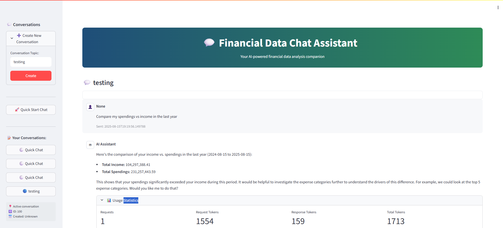

# Financial Data Processing System - Technical Report

## Project Overview and Architecture

This system integrates diverse financial data sources into a unified backend with AI-powered natural language querying capabilities. Built for the Kudwa AI Engineer take-home test, it demonstrates practical AI/ML integration, backend architecture, and API design.

**Core Components:**
- **FastAPI Backend** (`main.py`): Creates database tables, runs data ingestion on startup, and serves REST APIs
- **Data Ingestion** (`ingest.py`): Parses two different JSON financial data formats into a unified schema
- **Database Models** (`data/models.py`): SQLModel schemas for financial statements and conversation tracking
- **API Routes** (`routers/routes.py`): RESTful endpoints for conversations, messages, and AI interactions
- **AI Layer**: MCP server/client architecture for natural language financial data querying

## Technology Stack and Rationale

**Backend Framework**: FastAPI - chosen for automatic API documentation, async support, and fast development

**Database**: PostgreSQL with SQLModel ORM - provides robust data handling and type safety

**AI/LLM**: Google Gemini via Pydantic-AI - selected for strong reasoning capabilities and cost-effectiveness

**Communication Protocol**: MCP (Model Context Protocol) - enables secure, structured AI-database interactions

**Deployment**: Docker Compose - simplifies multi-service orchestration

**AI Architecture Decision**: The MCP server/client pattern was chosen to:
- Provide secure database access with read-only SQL validation
- Enable schema inspection and fuzzy account name searching
- Maintain conversation context across interactions
- Separate AI logic from database operations

## Database Schema and Data Processing

### Database Schema (`data/models.py`)

The system uses three main SQLModel tables:

**FinancialStatement** - Core financial data storage:
- `id`: Auto-incrementing primary key
- `period`: Date field representing the first day of the reporting period
- `account_id`: String identifier for the account (indexed for performance)
- `account_name`: Human-readable account name (indexed for search)
- `amount`: Float value for the financial amount
- `parent_account_id`: Optional foreign key for hierarchical account relationships

**Conversation** - Chat session management:
- `id`: Primary key
- `topic`: Optional conversation topic
- `created_time`: Timestamp of conversation creation
- `messages`: Relationship to associated messages

**Message** - Individual chat messages:
- `id`: Primary key
- `conversation_id`: Foreign key to conversation
- `sender_type`: Either "user" or "system"
- `sender`: Optional sender identifier
- `content`: Message text content
- `sent_time`: Message timestamp
- `usage`: JSON field storing LLM usage statistics (token counts, model info)

### Data Ingestion Process (`ingest.py`)

The system processes two distinct JSON financial data formats:

**Data Set 1 (QuickBooks-like format)**:
- Column-based structure with nested hierarchical rows
- Extracts account information from first column (ID, name)
- Maps subsequent columns to time periods using metadata or column titles
- Recursively walks nested row structures to find "Data" type rows
- Handles month-year formats like "Jan 2020" converted to first-of-month dates
- Processes numeric values with comma removal and float conversion

**Data Set 2 (Hierarchical JSON format)**:
- Structured by financial categories (revenue, cost_of_goods_sold, operating_expenses, etc.)
- Extracts period dates from "period_start" fields
- Recursively processes line_items within each category to maintain parent-child relationships
- Generates account_ids from names when not explicitly provided
- Calculates and stores derived metrics (gross_profit, operating_profit, net_profit)

**Unified Processing**:
Both formats are normalized into the same FinancialStatement schema, enabling consistent querying across different data sources. The ingestion automatically runs on application startup if the database is empty, ensuring data availability for AI interactions.

## Setup and Installation Instructions

**Prerequisites:**
- Docker and Docker Compose
- Google Gemini API key

**Quick Start:**

1. Create `.env` file:
```env
GOOGLE_API_KEY=your_google_api_key_here
```

2. Deploy with Docker Compose:
```bash
docker compose up --build
```

**What happens on startup:**
- PostgreSQL database starts on port 5437
- Application creates database tables
- System checks if financial data exists, runs ingestion if needed
- FastAPI server starts on port 8430
- Streamlit frontend starts on port 8431

**Access Points:**
- API Documentation: `http://localhost:8430/docs`
- Web Interface: `http://localhost:8431`

## AI/ML Approach and Model Choices

**Architecture**: MCP (Model Context Protocol) server/client pattern

**MCP Server** (`mcpagent/server.py`):
- **Tool: `query_database`** - Primary interface with three modes:
  - `sql_query`: Execute safe SELECT statements with automatic LIMIT enforcement
  - `search_account_term`: Fuzzy search for account names using difflib
  - `fetch_schema`: Return database schema for context
- **Safety Features**: SQL validation, read-only enforcement, query sanitization
- **Optimization**: Cached account name lookups, automatic PostgreSQL pg_trgm extension

**AI Client** (`mcpagent/client.py`):
- **Framework**: Pydantic-AI with structured agent workflow
- **Model**: Gemini 2.0 Flash - chosen for balance of performance and cost
- **Context Management**: Embeds live database schema in system prompt
- **Conversation Flow**: 
  1. Understand user's financial question
  2. Search for relevant account names if needed
  3. Construct and execute SQL queries
  4. Analyze results and provide business insights

**Agent Capabilities:**
- Natural language to SQL translation
- Financial data interpretation and analysis
- Context-aware follow-up questions
- Usage tracking and conversation history

**Potential Improvements:**
- **Enhanced Metadata**: Add transaction type fields (e.g., "revenue", "expense", "profit") to each financial statement record, reducing reliance on keyword-based account name matching. This would enable more precise categorization and querying of financial data.
- **Semantic Search Integration**: Implement vector embeddings for transaction descriptions and account names to enable semantic similarity searches. This would allow the LLM to find relevant transactions based on meaning rather than exact keyword matches.
- **Improved Query Intelligence**: With metadata tags, the AI could better understand transaction types and provide more accurate financial analysis without depending solely on account name parsing.

## User Interface and Frontend (`frontend.py`)

**Framework**: Streamlit - chosen for rapid development of interactive data applications

The web interface provides an intuitive chat-based experience for financial data analysis:

**Key Features:**
- **Conversation Management**: Create, select, and manage multiple chat sessions with optional topic naming
- **Real-time Chat Interface**: Chat-style UI with user and AI messages, including timestamps and sender information
- **System Health Monitoring**: Built-in API health checks and connection status indicators
- **Usage Analytics**: Display LLM token usage statistics for each AI response
- **Responsive Design**: Custom CSS styling with gradient headers and conversation cards
- **Error Handling**: Graceful error handling with user-friendly error messages

**Interface Components:**
- **Sidebar**: Conversation list, creation tools, quick start options, and system status
- **Main Chat Area**: Scrollable message history with distinct styling for user vs AI messages
- **Input Form**: Multi-line text input with optional sender name and send functionality
- **Welcome Screen**: Informative landing page when no conversation is selected

**User Experience Flow:**
1. Users create or select a conversation from the sidebar
2. Type natural language questions about financial data
3. Receive AI-generated insights with supporting data
4. View conversation history and usage statistics
5. Switch between multiple ongoing conversations

**API Integration**: The frontend communicates with the FastAPI backend through RESTful endpoints, handling conversation CRUD operations and AI interactions seamlessly.

### User Interface Screenshots



- Main chat interface with conversation sidebar
- Example financial data queries and AI responses
- Conversation management and creation flow
- Usage statistics and system health indicators

## Known Issues and Limitations

**Current Limitations:**
- **Free Text Account Names**: Account names are stored as unstructured text, making precise querying challenging. The system relies on fuzzy search and keyword matching, which may miss semantically related accounts with different naming conventions.

**Development Notes:**
- Ingestion runs automatically on empty database detection
- Conversation history maintained for context but may grow large over time

---

This technical architecture enables users to query financial data naturally (e.g., "What was our Q1 profit?") while maintaining data security and providing structured, business-relevant responses.

